地球社会共生学部ではどのような学びが待っているのでしょう。地球社会共生学部の教員の紹介と、その授業内容をお伝えします。

<ul class="list-teacher">
<li>
 

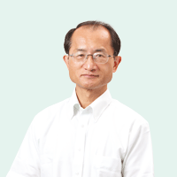

  

  

    
岩田 伸人 Nobuto IWATA

    
教授 貿易政策 / 国際貿易理論

    <ul>
      <li><a href="http://raweb1.jm.aoyama.ac.jp/aguhp/KgApp?kyoinId=ymkegysgggy" target="_blank">プロフィール・主要研究業績</a></li>
    </ul>    
  

      
<strong>受験生への一言</strong>

      
私の専門は国際貿易の研究です。グローバル化の中で、私たち個人も含めて企業のビジネス活動は、国内市場と海外市場の違いを超えて自由に移動できるようになりました。他方、インターネットやデジタル化が広まることで、新しい国際的な問題も発生しています。そんな近未来の社会について、一緒に考えてみませんか。

  

</li>
<li>
 

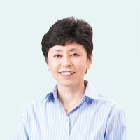

  

  

    
岡本 真佐子 Masako OKAMOTO

    
教授 文化人類学 / 文化政策学

    <ul>
      <li><a href="http://raweb1.jm.aoyama.ac.jp/aguhp/KgApp?kyoinId=ymiygegkggo" target="_blank">プロフィール・主要研究業績</a></li>
    </ul>
  

  
<strong>受験生への一言</strong>

  
主に文化に関わる分野の授業を担当しています。異文化との出会いは驚きや楽しさ、不安や戸惑いに満ちています。これらを全部面白がることができるような、色々な「力」をこの学部に入って身につけてくれることを期待しています。

  

</li>
<li>
 

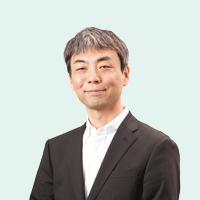

  

  

    
樺島 榮一郎 Eiichiro KABASHIMA

    
教授 コンテンツ産業論

    <ul>
      <li><a href="http://raweb1.jm.aoyama.ac.jp/aguhp/KgApp?kyoinId=ymdggeyoggy" target="_blank">プロフィール・主要研究業績</a></li>
    </ul>
    

    
<strong>受験生への一言</strong>

    
僕の専門はメディア研究です。現在インターネットがメディアの世界だけでなく、国家や世界のあり方も変えつつあります。個人に着目しても人生とは結局、体験＝情報ですから、衣食住足りた人々が増加するこれからの社会で、メディアや情報がさらに重要になることは疑いありません。そんなメディアを一緒に考えてみませんか。

  

<li>
 

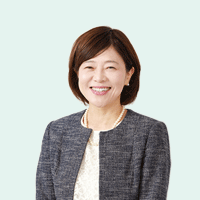

  

  

    
菊池 尚代 Hisayo KIKUCHI

    
教授 メディア論 / 英語教育

    <ul>
      <li><a href="http://raweb1.jm.aoyama.ac.jp/aguhp/KgApp?kyoinId=ymisgkykggy" target="_blank">プロフィール・主要研究業績</a></li>
    </ul>
    

    
<strong>受験生への一言</strong>

    
私の専門は「ことば」です。私たちの生活に当然のように存在する「ことば」ですが、話し手、聞き手の理解は必ずしも同じとは限りません。例えば英語の広告メッセージや映画タイトルは文化や国によってどう変化しているでしょう。メディアの発展や共通語としての英語の普及に伴ってさらに高まる「ことば」の不思議を一緒に解明しませんか。

  

</li>
 <li>
 

  

  

    
熊谷 奈緒子 Naoko KUMAGAI

    
教授 国際関係論 / 国際機構論 / 紛争解決論 / 和解学 / 人権

    <ul>
      <li><a href="https://raweb.jm.aoyama.ac.jp/aguhp/KgApp?kyoinId=ymdygdgoggy" target="_blank">プロフィール・主要研究業績</a></li>
    </ul>
    

    
<strong>受験生への一言</strong>

    
今日、紛争、難民、貧困、人権抑圧、地球温暖化、感染症問題などが、地球規模で生じています。日本を始めとした世界各国の政府や社会は、多様な利益や価値観をいかに調整して諸問題を解決し、よりよく共生してゆけるでしょうか。根本的な原因を追究し、当事者意識や共感をもって解決策を共に考えてゆきましょう。

  

  </li>
<li>
 

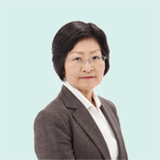

  

  

    
桑島 京子 Kyoko KUWAJIMA

    
教授 国際協力論 / 国際開発論 / 社会開発論

    <ul>
      <li><a href="http://raweb1.jm.aoyama.ac.jp/aguhp/KgApp?kyoinId=ymkdgssgggy" target="_blank">プロフィール・主要研究業績</a></li>
    </ul>
    

    
<strong>受験生への一言</strong>

    
長年にわたり、途上国に対する開発援助に取り組んできました。援助は一方的に寄付や、施設建設、技術の供与を行うことではなく、日本からの支援が途上国の努力や改革コミットメントに寄り沿って伴走して初めて実を結ぶ、という双方向の関係にあります。援助することは日本の問題の解決にもつながります。国際協力について、ともに学びませんか。

  

</li>
<li>
 

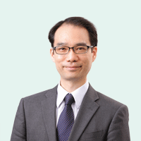

  

  

    
幸地 茂 Shigeru KOCHI

    
教授 国際関係論 / ラテンアメリカの地域研究

    <ul>
      <li><a href="http://raweb1.jm.aoyama.ac.jp/aguhp/KgApp?kyoinId=ymdygdomggy" target="_blank">プロフィール・主要研究業績</a></li>
    </ul>
  

  
<strong>受験生への一言</strong>

  
貧困や環境汚染など世界が抱える諸問題を勉強するにせよ、特定の国が抱える課題を勉強するにせよ、世界の第一線で活躍する人は、複数の専門分野に基づく学際的アプローチを必要とします。本学部では、経済学や社会学など、社会科学の分野に学際的にアプローチしつつ、世界の課題に挑戦するための強固な基盤を提供します。

  

</li>
<li>
 

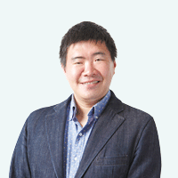

  

  

    
高橋 良輔 Ryosuke TAKAHASHI

    
教授 政治理論 / 国際関係論 / 政治社会学

    <ul>
      <li><a href="http://raweb1.jm.aoyama.ac.jp/aguhp/KgApp?kyoinId=ymdegyokggy" target="_blank">プロフィール・主要研究業績</a></li>
    </ul>
    

    
<strong>受験生への一言</strong>

    
もともとの専門！？は、政治哲学や社会理論、国際関係思想です。また大学院生時代には、国際協力NGOでの実践にも携わり、調査研究や政府・国際機関へのアドボカシー(政策提言)の仕事もしてきました。GSCでは、自分の興味や関心をしっかり整理して、学術研究と現場活動との往復を経験してもらえればと考えています。

  

</li>
<li>
 

  

  

    
林 拓也 Takuya HAYASHI

    
教授 経済史 / 経営史

    <ul>
      <li><a href="http://raweb1.jm.aoyama.ac.jp/aguhp/KgApp?kyoinId=ymdogkogggy" target="_blank">プロフィール・主要研究業績</a></li>
    </ul>
  

  
<strong>受験生への一言</strong>

  
青山学院大学の中で、GSCは地球社会での共生を考えるという高いミッションを持つとともに、キリスト教主義教育を根幹とした本学院の理念に最も近い学部のひとつといえます。まずは東南アジアへの留学を通じて、皆さんを知り、皆さんと繋がる現地の友を作ってください。皆さんのことを想う誰かが世界の中にいて、ともに塩となり、光となることを願っています。

  

</li>
<li>
 

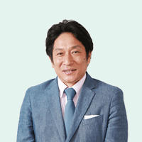

  

  

    
原 晋 Susumu HARA

    
教授 組織マネジメント / リーダーシップ / スポーツビジネス / スポーツふるさと創生

    <ul>
      <li><a href="https://raweb1.jm.aoyama.ac.jp/aguhp/KgApp?kyoinId=ymidgsgbggo" target="_blank">プロフィール・主要研究業績</a></li>
    </ul>    
  

  

</li>
 <li>
 

  

  

    
福原 直樹 Naoki FUKUHARA

    
教授 ジャーナリズム / 欧州政治

    <ul>
      <li><a href="https://raweb.jm.aoyama.ac.jp/aguhp/KgApp?kyoinId=ymkdgoysggo" target="_blank">プロフィール・主要研究業績</a></li>
    </ul>
    

    
<strong>受験生への一言</strong>

    
全国紙で事件記者と海外特派員（欧州・紛争地）をそれぞれ約15年間つとめました。日本をはじめ、国際社会には乗り越えるべき課題が噴出しています。自身の経験も踏まえながら、これらの課題への対応策を一緒に考えていきたいと思います。

  

  </li>
<li>
 

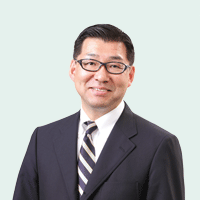

  

  

    
藤原 淳賀 The Revd. Dr. Prof. Atsuyoshi "Atty" FUJIWARA

    
教授 キリスト教神学 / 倫理学

    <ul>
      <li><a href="http://raweb1.jm.aoyama.ac.jp/aguhp/KgApp?kyoinId=ymikgoobggy" target="_blank">プロフィール・主要研究業績</a></li>
    </ul>
    

    
<strong>受験生への一言</strong>

    
大学時代は人生の土台を形成する時です。青山学院大学は「キリスト教信仰にもとづく教育をめざし、神の前に真実に生き、真理を謙虚に追求し、愛と奉仕の精神をもって、すべての人と社会とに対する責任を進んで果たす人間の形成を目的」としています。君が自分と異なる人々と世界で共生して生きたいと願うなら歓迎します。 

  

</li>
<li>
 

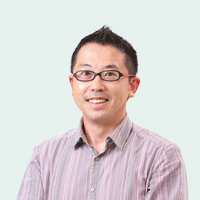

  

  

    
古橋 大地 Taichi FURUHASHI

    
教授 空間情報学 / 地図学

    <ul>
      <li><a href="http://raweb1.jm.aoyama.ac.jp/aguhp/KgApp?kyoinId=ymdkgsomggy" target="_blank">プロフィール・主要研究業績</a></li>
    </ul>
    

    
<strong>受験生への一言</strong>

    
「一億総伊能化」というキーワードで、世界中の仲間たちとみんなで世界地図をつくるプロジェクト「オープンストリートマップ」に取り組んでいます。ドローンや人工衛星など最先端の地図づくりの技術と、その情報を社会に役立てる手法の研究をフィールドワークを通して実践しているので、自分たちでつくった地図を片手に世界中を旅したい学生ウェルカムです！

  

</li>
<li>
 

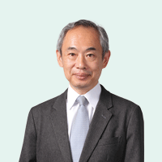

  

  

    
升本 潔 Kiyoshi MASUMOTO

    
教授 国際協力 / 環境と開発

    <ul>
      <li><a href="http://raweb1.jm.aoyama.ac.jp/aguhp/KgApp?kyoinId=ymkbyyokggy" target="_blank">プロフィール・主要研究業績</a></li>
    </ul>
    

    
<strong>受験生への一言</strong>

    
この世界は様々な課題が山積する一方、ドキドキするような魅力と大きな可能性に満ちています。本学部でのアジアの実体験や人との出会いは、世界に対する考え方やモノの見方を大きく変化させるはずです。皆さんの将来に新たな扉を開くお手伝いができればと思います。

  

</li>
<li>
 

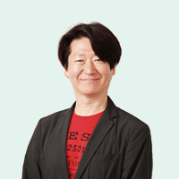

  

  

    
松永 エリック・匡史 Eric-Masanobu MATSUNAGA

    
教授 国際経営学 / デジタルトランスフォーメーション / 人材・組織マネジメント / PR戦略論

    <ul>
      <li><a href="https://raweb1.jm.aoyama.ac.jp/aguhp/KgApp?kyoinId=ymidgsokggo" target="_blank">プロフィール・主要研究業績</a></li>
    </ul>    
  

  
<strong>受験生への一言</strong>

  
20年間ビジネスコンサルタントとして世界を舞台に国際ビジネス、デジタルイノベーションの最先端を走り続けました。デジタルの時代は経済圏をはるかに超えた世界の共生からイノベーションが生み出されます。地球社会共生学部は、教員、生徒、スタッフ、そして留学先の仲間達と壁のない”共生”を体験できる面白い学部です。是非、私達の仲間になりませんか？

  

</li>
<li>
 

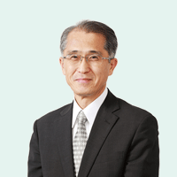

  

  

    
村上 広史 Hiroshi MURAKAMI

    
教授 写真測量学 / 地理空間情報学 / リモートセンシング / 地理情報システム（GIS)

    <ul>
      <li><a href="https://raweb1.jm.aoyama.ac.jp/aguhp/KgApp?kyoinId=ymkbgyogggo" target="_blank">プロフィール・主要研究業績</a></li>
    </ul>    
  

  
<strong>受験生への一言</strong>

  
三次元空間に生きる私たちが、互いに賢く「共生」するためには、場所の情報を適切に活用する必要があります。災害や犯罪の起きやすさ、生活のしやすさなどは、場所によって全く異なるからです。場所の情報（空間情報）の活用の仕方や意味を一緒に学んで、賢く共生できる地球人を目指しませんか？

  

</li>
<li>
 

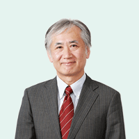

  

  

    
山下 隆之 Takayuki YAMASHITA

    
教授 ミクロ経済学 / システム・ダイナミクス

    <ul>
      <li><a href="https://raweb1.jm.aoyama.ac.jp/aguhp/KgApp?kyoinId=ymiogeodggy" target="_blank">プロフィール・主要研究業績</a></li>
    </ul>    
  

  
<strong>受験生への一言</strong>

  
地球社会が抱える諸課題の根底には、しばしば経済問題が潜んでいます。少子高齢社会の到来が経済成長へ与える影響、人口減少が地域経済の企業間競争に与える影響、新規産業の展開の遅れによる産業空洞化など、日米欧の先進国が直面している問題を研究しています。

  

</li>
 <li>
 

  

  

    
亀井ダイチ アンドリュー Andrew KAMEI-DYCHE

    
准教授 歴史学 / 日本学 / 出版文化 / メディア / ヒューマンネットワーク研究

    <ul>
      <li><a href="https://raweb.jm.aoyama.ac.jp/aguhp/KgApp?kyoinId=ymdbgmoiggy" target="_blank">プロフィール・主要研究業績</a></li>
    </ul>
    

    
<strong>受験生への一言</strong>

    
私の専門は歴史、特に日本出版文化史で、なかでもヒューマン・ネットワークの考察をその基盤にしています。現代のSNSだけでなく、人のつながりは昔から社会の基軸として存在していました。知識や情報を得る上で、こうしたつながりがどう機能するのか。こうした視点を通じて、過去・現在・未来の社会を考えるきっかけを作っていって欲しいと思います。

  

  </li>
<li>
 

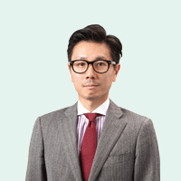

  

  

    
小堀 真 Makoto KOBORI

    
准教授 宗教社会学 / 社会調査法

    <ul>
      <li><a href="http://raweb1.jm.aoyama.ac.jp/aguhp/KgApp?kyoinId=ymddygysggy" target="_blank">プロフィール・主要研究業績</a></li>
    </ul>
  

  
<strong>受験生への一言</strong>

  
多様化する現代社会における「共生」について学び、考え、そして体験する。本学部の留学は、皆さんの世界を大きく広げるきっかけとなるでしょう。地球を舞台に羽ばたく皆さんを応援します。

  

</li>
<li>
 

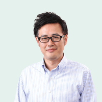

  

  

    
齋藤 大輔 Daisuke SAITO

    
准教授 東南アジア地域研究 / 文化人類学

    <ul>
      <li><a href="http://raweb1.jm.aoyama.ac.jp/aguhp/KgApp?kyoinId=ymdigyygggy" target="_blank">プロフィール・主要研究業績</a></li>
    </ul>
    

    
<strong>受験生への一言</strong>

    
現在、日本では多くの東南アジアからの観光客を目にするようになっています。しかし、欧米と比較するとまだまだ「遠い」存在でもあると感じています。グローバルな世界の中で生きる私たちに必要なことの一つは、グローバル＝欧米だけではなく、他の地域にも目を向ける視点と知識を養うことではないでしょうか。私は東南アジアという地域を中心に共に考えていけたらと思います。

  

</li>
<li>
 

  

  

    
咲川 可央子 Kaoko SAKIKAWA

    
准教授 経済学 / 開発経済学 / ラテンアメリカ地域研究 / メキシコ経済

    <ul>
      <li><a href="https://raweb1.jm.aoyama.ac.jp/aguhp/KgApp?kyoinId=ymdsyogeggy" target="_blank">プロフィール・主要研究業績</a></li>
    </ul>    
  

  
<strong>受験生への一言</strong>

  
開発経済学を、1. 経済学の理論、2. 実証、3. 地域・国の特色という3本柱をたてて研究してきました。学生時代には、グアテマラ農村でのNGO活動、メキシコ留学の経験があります。若さとは武器です！やりたいと思ったことには積極的にアプローチしてみてください。活動を通じて、良き友人や師と出会えるといいですね。

  

</li>
<li>
 

  

  

    
菅野 美佐子 Misako KANNO

    
助教 文化人類学 / ジェンダー論 / 南アジア地域研究

    <ul>
      <li><a href="https://raweb.jm.aoyama.ac.jp/aguhp/KgApp?kyoinId=ymdkgdyiggy" target="_blank">プロフィール・主要研究業績</a></li>
    </ul>
    

    
<strong>受験生への一言</strong>

    
大学という学びの場では、積極的に興味関心を見い出し、それに向かって自ら行動することが大切です。グローバル化が進むこの時代は、自分の常識を超えた未知の経験に触れるチャンスに溢れています。さまざまな価値観や常識をもつ人々と「共に生きる」社会づくりについて、一緒に考え、学んで行きましょう。

  

</li>
<li>
 

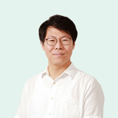

  

  

    
申 在烈 Jae Youl SHIN

    
助教 社会学 / 社会福祉学 / 政治学 / 応用経済学

    <ul>
      <li><a href="https://raweb1.jm.aoyama.ac.jp/aguhp/KgApp?kyoinId=ymbegoodggy" target="_blank">プロフィール・主要研究業績</a></li>
    </ul>    
  

  
<strong>受験生への一言</strong>

  
私は社会学者として「不平等のメカニズム」と「不平等に対する人々の態度」を研究しています。不平等は個人の経済的な困窮はもとより、社会の安定、健康なコミュニティの維持など、私たちの日常生活に多大な影響を与えます。社会学の視座から不平等のメカニズムを勉強しながら、「共生」の意味を一緒に考えましょう。

  

</li>
<li>
 

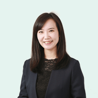

  

  

    
髙田 百合奈 Yurina TAKATA

    
助教 情報デザイン / webシステム / 地理情報システム / 可視化

    <ul>
      <li><a href="https://raweb1.jm.aoyama.ac.jp/aguhp/KgApp?kyoinId=ymbbgbgsggy" target="_blank">プロフィール・主要研究業績</a></li>
    </ul>    
  

  
<strong>受験生への一言</strong>

  
まだ自分のやりたいことや将来の目標が定まっていない人もいるのではないでしょうか。皆さんが自分の好きなことに出会えるように、私は地図や地球儀をベースとしたツールを使って、世界を知る、世界に羽ばたく、世界の人々と共生するためのサポートをします。そこから自分の好きなことに出会えたらチャンスです。それに向かって是非チャレンジしてみてください。

  

</li>
 <li>
 

  

  

    
橋本 彩花 Sayaka HASHIMOTO

    
助教 国際比較教育学 / 日本語教育学

    <ul>
      <li><a href="http://raweb.jm.aoyama.ac.jp/aguhp/KgApp?kyoinId=ymbsgdyoggy" target="_blank">プロフィール・主要研究業績</a></li>
    </ul>
    

    
<strong>受験生への一言</strong>

    
多様化する現代社会における「共生」について学び、考え、そして体験する。本学部の留学は、皆さんの世界を大きく広げるきっかけとなるでしょう。地球を舞台に羽ばたく皆さんを応援します。

  

  </li>
